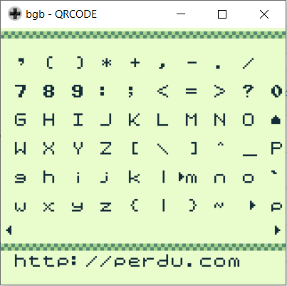
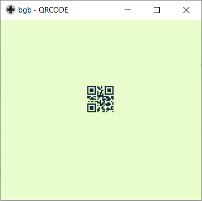

# qrcodesGB
qr code generator from scratch in asm
---

---
## Features
- qr code generation up to 17 ASCII characters
- full ASCII keyboard
- RS ECC codes tested with [sikuli](http://doc.sikuli.org)

## Build
Use rgbds **v0.4**

## TODO :
1. improve the part that place tiles in OAM
2. get rid of gingerbread lib
3. bigger qrcodes (tilesgenerator will probably be useless then)
4. implement more spec of qr Codes
5. gameboy printer compatibility ?

